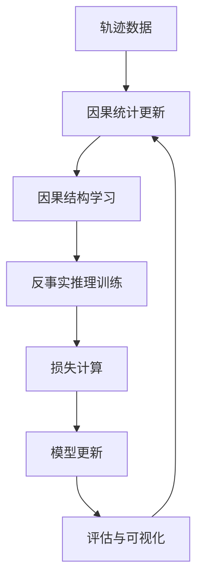

# 🚁 Causal Decision Transformer

A causal reasoning-based aerial combat decision agent training framework that combines Decision Transformer and Causal Graph Networks for intelligent decision-making in complex multi-task aerial combat environments.

## 🚀 Key Features

- **Causal Reasoning Enhancement**: Integrated causal graph networks supporting multi-level and temporal causal relationship modeling
- **Counterfactual Decision Making**: Evaluate potential impacts of different decisions through counterfactual reasoning
- **Multi-Task Learning**: Support multi-task coordinated decision-making in complex aerial combat scenarios
- **Adaptive Training**: Multi-stage training strategy (exploration-refinement-exploitation)
- **Uncertainty Estimation**: Built-in uncertainty quantification and adaptive exploration mechanisms
- **Real-Time Simulation**: High-fidelity aerial combat simulation environment based on Harfang 3D engine

## 📋 目录结构

```
odt/
├── decision_transformer/          # 决策转换器核心模块
│   └── models/
│       ├── decision_transformer.py    # 主模型实现
│       ├── causal_graph.py           # 因果图网络
│       ├── causal_trainer.py         # 因果训练器
│       └── model.py                  # 基础模型组件
├── gym_dogfight/                 # 空战仿真环境
│   ├── envs/dogfightEnv/        # 环境实现
│   └── spaces/                   # 动作和状态空间定义
├── causal_dt_trainer.py          # 因果序列训练器
├── main.py                       # 主训练脚本
├── trainer.py                    # 标准训练器
├── evaluation.py                 # 评估模块
└── data.py                       # 数据处理模块
```

## 🛠️ 安装要求

### 系统要求
- Python 3.8+
- CUDA 11.0+ (推荐使用GPU)
- Windows/Linux

### 依赖安装

1. **克隆项目**
```bash
git clone <repository-url>
cd odt
```

2. **安装Python依赖**
```bash
pip install torch torchvision torchaudio --index-url https://download.pytorch.org/whl/cu118
pip install transformers==4.5.1
pip install tensorboardX
pip install numpy scipy matplotlib
pip install scikit-learn networkx
pip install harfang
```

3. **安装仿真环境**
```bash
pip install -e .
```

## 🎯 快速开始

### 1. 数据准备

确保在 `collected_data/` 目录下有训练数据文件：
```
collected_data/
└── episodes_20250915-102016.pkl
```

### 2. 基础训练

```bash
python main.py \
    --env data_collection-v0 \
    --online_env onevsone_ap-v0 \
    --K 20 \
    --embed_dim 512 \
    --n_layer 4 \
    --n_head 4 \
    --batch_size 32 \
    --learning_rate 1e-4 \
    --max_pretrain_iters 2 \
    --max_online_iters 1500
```

### 3. 因果增强训练

启用因果图网络和反事实决策：
```bash
python main.py \
    --use_causal_graph True \
    --num_tasks 5 \
    --causal_discovery_method pc \
    --sparsity_weight 0.1 \
    --consistency_weight 0.2
```

### 4. 评估模型

```bash
python evaluation.py \
    --model_path ./exp/model.pt \
    --num_eval_episodes 10 \
    --eval_rtg 3600
```

## 🧠 技术架构

### 核心组件

#### 1. 决策转换器 (DecisionTransformer)
- 基于 GPT-2 架构的序列建模
- 支持状态-动作-奖励-回报的联合建模
- 集成随机策略和温度调节机制

#### 2. 因果图网络 (CausalGraph)
- **多层次因果矩阵**: 建模不同抽象层次的任务关系
- **时序因果建模**: 捕获延迟因果效应
- **注意力融合**: 使用多头注意力整合因果影响

#### 3. 反事实决策模块 (CounterfactualDecisionMaker)
- **软干预**: 对任务分布进行可控强度的干预
- **不确定性估计**: 基于熵的不确定性量化
- **自适应探索**: 根据不确定性动态调整探索策略

#### 4. 因果训练器 (CausalTrainer)
- **结构学习**: 支持 PC、Granger、评分等因果发现算法
- **反事实训练**: 多样性约束和一致性正则化
- **自适应策略**: 多阶段训练和动态权重调整

### 训练流程



## 📊 实验配置

### 模型参数
- **序列长度**: K=20
- **嵌入维度**: 512
- **Transformer层数**: 4
- **注意力头数**: 4
- **批次大小**: 32

### 训练参数
- **学习率**: 1e-4
- **权重衰减**: 5e-4
- **预训练轮数**: 2
- **在线训练轮数**: 1500
- **评估间隔**: 10

### 因果参数
- **任务数量**: 5
- **稀疏性权重**: 0.1
- **一致性权重**: 0.2
- **干预强度**: 0.8-1.0

## 📈 性能监控

### TensorBoard 可视化
```bash
tensorboard --logdir ./exp/logs
```

### 关键指标
- **任务准确率**: 多任务分类性能
- **反事实多样性**: 不同干预的效果差异
- **因果稀疏度**: 学习到的因果结构复杂度
- **不确定性校准**: 不确定性与预测错误的相关性

## 🔧 高级配置

### 环境配置
```python
# 仿真服务器配置
--host 172.27.240.1
--port 57805

# 环境参数
--env data_collection-v0      # 数据收集环境
--online_env onevsone_ap-v0   # 在线训练环境
```

### 因果发现方法
- `pc`: PC算法启发式实现
- `granger`: Granger因果性
- `score`: 基于互信息的评分方法

### 训练阶段
- `initial`: 初始结构学习阶段
- `refinement`: 精炼阶段
- `exploitation`: 利用阶段

## 🐛 故障排除

### 常见问题

1. **CUDA内存不足**
   ```bash
   # 减少批次大小
   --batch_size 16
   
   # 或使用CPU训练
   --device cpu
   ```

2. **仿真连接失败**
   ```bash
   # 检查服务器地址和端口
   --host <your_server_ip>
   --port <your_server_port>
   ```

3. **数据加载错误**
   ```bash
   # 确保数据文件路径正确
   # 检查 main.py 中的 loc 变量
   ```

## 📚 相关论文

- Decision Transformer: Reinforcement Learning via Sequence Modeling
- Causal Reasoning in Deep Reinforcement Learning
- Counterfactual Multi-Agent Policy Gradients

## 🤝 贡献指南

1. Fork 项目
2. 创建特性分支 (`git checkout -b feature/AmazingFeature`)
3. 提交更改 (`git commit -m 'Add some AmazingFeature'`)
4. 推送到分支 (`git push origin feature/AmazingFeature`)
5. 开启 Pull Request

## 📄 许可证

本项目采用 MIT 许可证 - 查看 [LICENSE](LICENSE) 文件了解详情。

## 👥 作者

- **bafs** - *初始工作* - [GitHub](https://github.com/bafs)

## 🙏 致谢

- Harfang 3D 引擎团队
- Transformers 库开发者
- 空战仿真社区的贡献者

---

**注意**: 本项目仅用于研究和教育目的。请确保在合法合规的框架内使用。